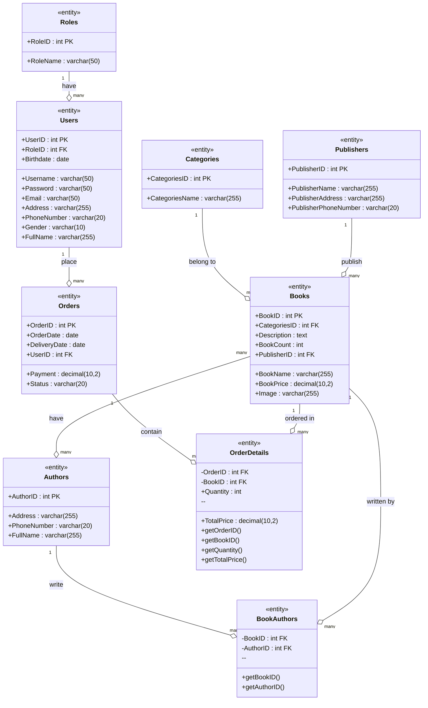

```mermaid
classDiagram
    class Categories{
        <<entity>>
        +CategoriesID : int PK
        +CategoriesName : varchar(255)
    }
    class Publishers{
        <<entity>>
        +PublisherID : int PK
        +PublisherName : varchar(255)
        +PublisherAddress : varchar(255)
        +PublisherPhoneNumber : varchar(20)
    }
    class Books{
        <<entity>>
        +BookID : int PK
        +CategoriesID : int FK
        +BookName : varchar(255)
        +BookPrice : decimal(10,2)
        +Description : text
        +Image : varchar(255)
        +BookCount : int
        +PublisherID : int FK
    }
    class Authors{
        <<entity>>
        +AuthorID : int PK
        +Address : varchar(255)
        +PhoneNumber : varchar(20)
        +FullName : varchar(255)
    }
    class Roles{
        <<entity>>
        +RoleID : int PK
        +RoleName : varchar(50)
    }
    class Users{
        <<entity>>
        +UserID : int PK
        +RoleID : int FK
        +Username : varchar(50)
        +Password : varchar(50)
        +Email : varchar(50)
        +Address : varchar(255)
        +PhoneNumber : varchar(20)
        +Gender : varchar(10)
        +Birthdate : date
        +FullName : varchar(255)
    }
    class Orders{
        <<entity>>
        +OrderID : int PK
        +Payment : decimal(10,2)
        +Status : varchar(20)
        +OrderDate : date
        +DeliveryDate : date
        +UserID : int FK
    }
    class OrderDetails{
        <<entity>>
        -OrderID : int FK
        -BookID : int FK
        +Quantity : int
        +TotalPrice : decimal(10,2)
        --
        +getOrderID()
        +getBookID()
        +getQuantity()
        +getTotalPrice()
    }
    class BookAuthors{
        <<entity>>
        -BookID : int FK
        -AuthorID : int FK
        --
        +getBookID()
        +getAuthorID()
    }
    
    Categories "1" --o "many" Books : belong to
    Publishers "1" --o "many" Books : publish
    Books "many" --o "many" Authors : have
    Roles "1" --o "many" Users : have
    Users "1" --o "many" Orders : place
    Orders "1" --o "many" OrderDetails : contain
    Books "1" --o "many" OrderDetails : ordered in
    Authors "1" --o "many" BookAuthors : write
    Books "1" --o "many" BookAuthors : written by

```
